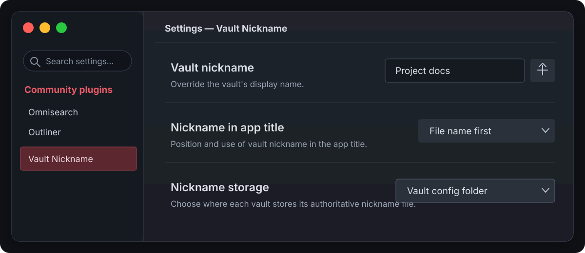

# Vault Nickname, a plugin for [Obsidian](https://obsidian.md/)

## Features:
* Set a custom vault display name without renaming its folder.
* Choose where the nickname is stored: in the plugin folder, the vault's Obsidian config folder, or the vault root.
* Choose the order of Obsidian's app title:
    1. Vault name before the document; or,
    2. Document name before the vault
* A new context menu item on the vault switcher menu provides quick access to changing the vault's nickname.
    

## Motive:
This plugin is intended to help disambiguate vaults that share the same folder name. This is common for users who adhere to a standard file structure between multiple projects. E.g., a "docs/" folder within each project.

Configurable nickname storage also keeps vault identity separate from plugin installation state. This matters when plugin directories are shared or symlinked between vaults: the shared plugin settings can select the same storage policy everywhere, while each vault keeps its own nickname in its config folder.

## With thanks to:
* **@claremacrae** for her generous github sponsorship and bug reporting! ❤️
* **@t0b1hh** for testing and reporting an issue affecting macOS.
* **@jakeanq** for testing and reporting an issue affecting Arch Linux.
* **@rashad-malik** for suggesting the nickname file be kept in the plugin's install directory.
* **@dominique-unruh** for reporting a regression on Linux.
* **@dudareviv** for adding support for reading UF8-BOM nickname config files.

## Install guide:
1. Open Obsidian's **Settings**.
2. Choose **Community plugins** from the left side bar.
3. If Restricted Mode is enabled, tap **Turn on community plugins** to disable it. Otherwise, skip this step.
4. Tap **Browse**.
5. Type `Vault Nickname` in the search bar.
6. Tap the **Vault Nickname** plugin.
7. Tap **Install**.
8. Tap **Enable**.
9. Tap **Options** to enter your custom nickname.
10. Done!

> [!IMPORTANT]  
> 🚨 Vault Nickname must be installed in each vault where you wish to see other vault nicknames from.
>
> This is required because plugins can only affect the user interface of vaults where they're installed. If a vault doesn't need a nickname itself, but needs to see other vaults' nicknames, you may still install the plugin and simply clear the nickname field for the already-correct vault.

## Plugin settings:

### Vault nickname

The name to display instead of the vault's folder name. When this is blank, the vault's display name will fallback to its default value (its folder name). The button next to this setting assigns the vault's parent folder's name as the nickname. The parent folder's name is treated as the default nickname when the plugin is installed.

### Nickname in app title

Choose how the nickname is applied to the app's title. The default value is "File name first" which is consistent with Obsidian's default behavior except the vault's nickname will be used.

### Nickname storage

Choose the authoritative file from which this vault's nickname is read and to which future changes are written:

* **Plugin folder (default)** — `<vault>/<config>/plugins/vault-nickname/data-shared.json`. This preserves the behavior of versions 1.1.9 and newer.
* **Vault config folder** — `<vault>/<config>/.vault-nickname`, normally `<vault>/.obsidian/.vault-nickname`. Use this when plugin directories are shared or symlinked: the selector in `data.json` may be shared, while the nickname remains local to each vault.
* **Vault root (legacy)** — `<vault>/.vault-nickname`. This location can also be read by plugin versions earlier than 1.1.9.

When upgrading from the previous toggle, disabled backwards compatibility maps to **Plugin folder**. Enabled backwards compatibility maps to **Vault root**, and the root file is read before the plugin copy so its value remains authoritative. A root-only nickname from a pre-1.1.9 installation is imported into the plugin-folder location. Changing the selected location writes the current nickname there and deliberately leaves the previous file untouched.
